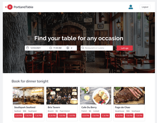
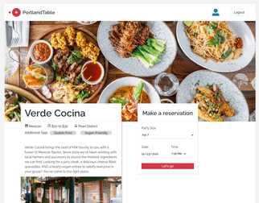
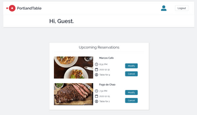

# README

## PortlandTable

PortlandTable is an OpenTable clone that allows users to make mock reservations at Portland Restaurants. 

[Visit PortlandTable](https://portlandtable.herokuapp.com/#/)

  
* Restaurant View
  
PortlandTable opens to a splash page of restaurants sorted by category. Users can gauge their interest in restaurants based on their photo, cuisine, price, and neighborhood. From the splash page, users can navigate to individual restaurant show pages to see additional details and create a reservation.
  

  
* Reservations
  
Logged-in users can create reservations for each restaurant. Additionally, they may view, edit, and delete their upcoming reservations in the User Profile.
  

* Technologies Used
  
Ruby version: 2.7.2

Node.js v14.15.4

Ruby on Rails 5.2.6

AWS

Heroku
 
